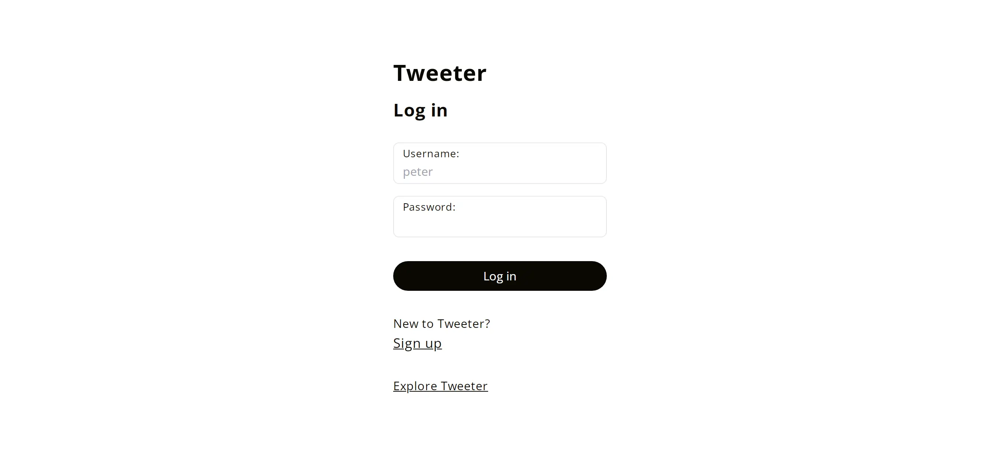
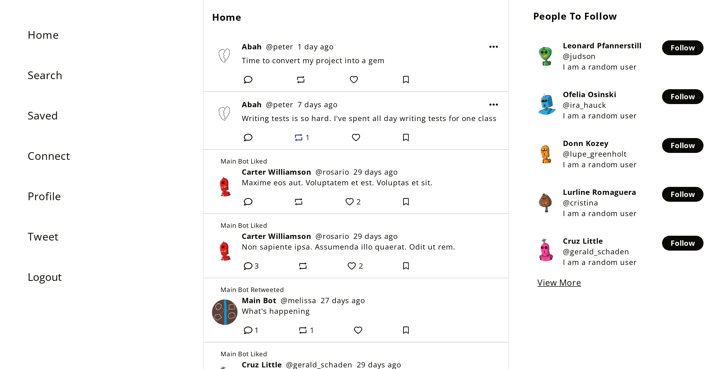
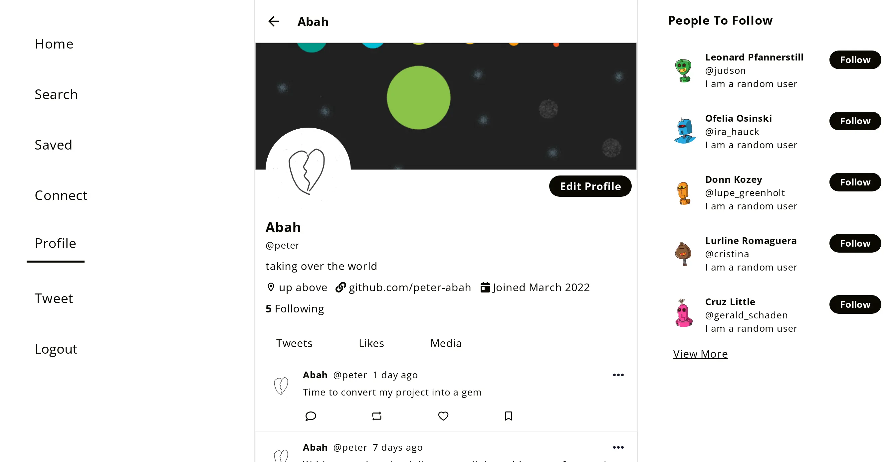
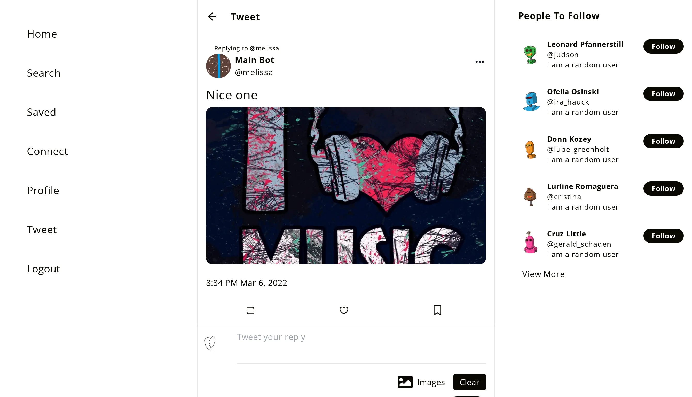
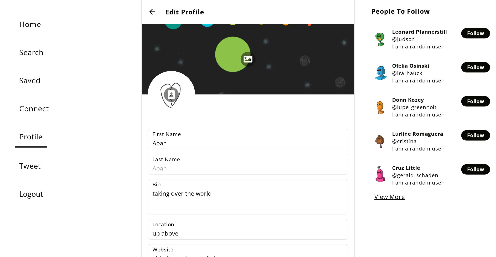
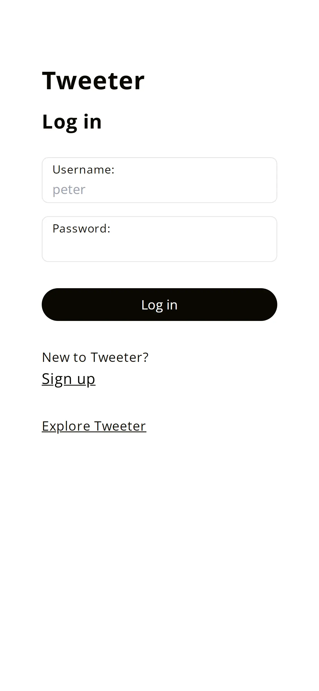
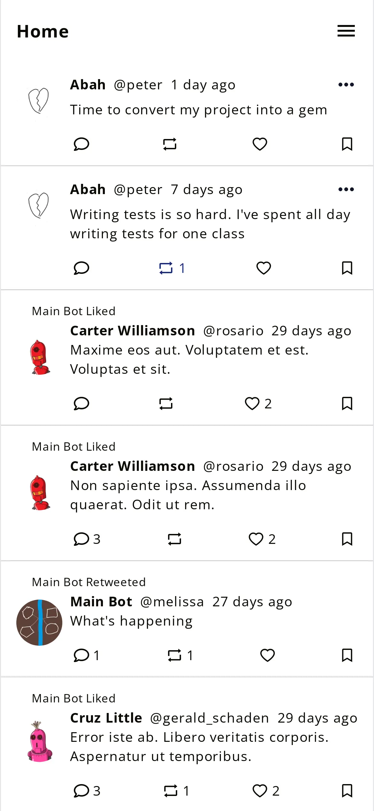

# Tweetar
This is clone of [Twitter](https://twitter.com) built with React
frontend and [Rails](https://github.com/peter-abah/tweetar-api) backend.

[**Live Here**](https://tweetar.vercel.app)

## Features
### User Profile
- Edit profile.
- Follow / Unfollow users to view their tweets on feed.
- Suggests people to follow based on followed users.
- Create and delete Tweets.

### Tweets
- Like tweets.
- Retweet tweets.
- Reply tweets with new tweets.
- Bookmark tweets
- Add images to tweets

### Search
- Search for other users and tweets

## Getting started

```
git clone https://github.com/peter-abah/tweetar

cd tweetar

npm install

npm run start
```

This will start the app on server on port 3000

## Screenshots
### Login page


### Home


### User profile


### Tweet


### Edit Profile


### Mobile



## Contact
- Twitter [@obekpa__](https://twitter.com/obekpa__)
